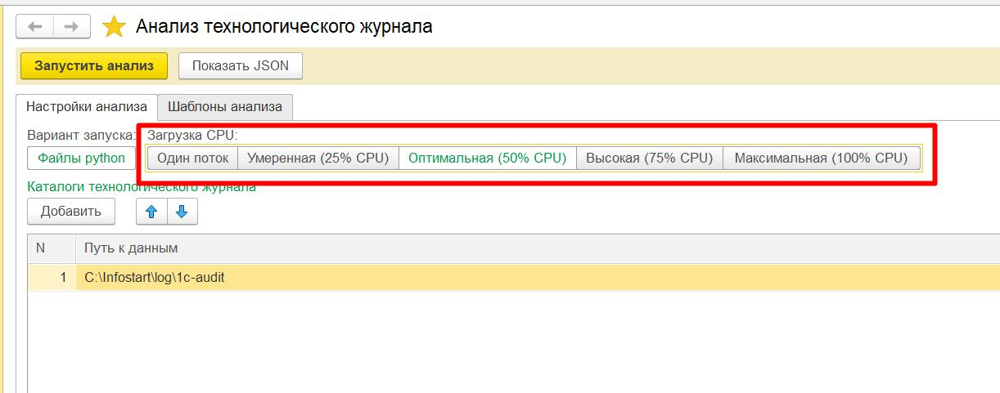
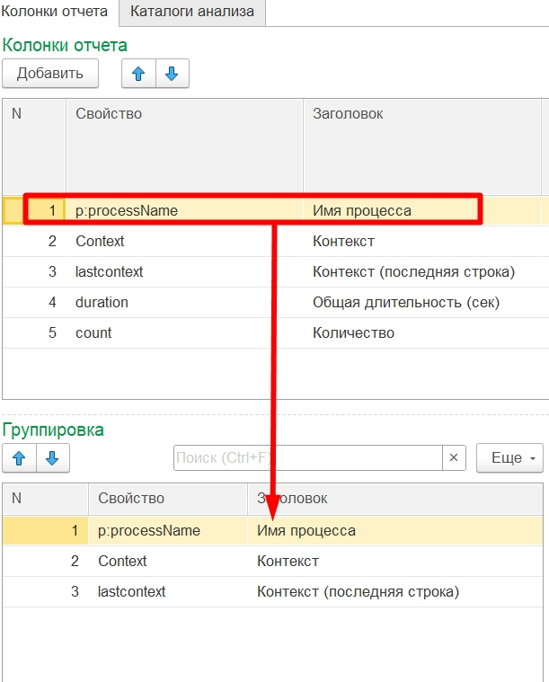

# Руководство пользователя

## Содержание
- [Руководство пользователя](#руководство-пользователя)
  - [Содержание](#содержание)
  - [Запуск через информационную базу "Анализ технологического журнала"](#запуск-через-информационную-базу-анализ-технологического-журнала)
    - [1. Подготовка](#1-подготовка)
      - [Конфигурация технологического журнала](#конфигурация-технологического-журнала)
    - [2. Запуск обработки](#2-запуск-обработки)
    - [3. Настройка параметров](#3-настройка-параметров)
    - [4. Контроль CPU](#4-контроль-cpu)
    - [5. Выбор шаблонов анализа](#5-выбор-шаблонов-анализа)
    - [6. Настройка каталогов анализа](#6-настройка-каталогов-анализа)
      - [Групповое изменение каталогов анализа](#групповое-изменение-каталогов-анализа)
    - [7. Заполнение отборов](#7-заполнение-отборов)
    - [8. Запуск анализа](#8-запуск-анализа)
    - [9. Результаты анализа](#9-результаты-анализа)
    - [10. Ручной запуск](#10-ручной-запуск)
  - [Настройка шаблона анализа](#настройка-шаблона-анализа)
    - [1. Основные настройки](#1-основные-настройки)
      - [Обязательные параметры](#обязательные-параметры)
      - [Работа с колонками](#работа-с-колонками)
      - [Каталоги анализа](#каталоги-анализа)
      - [Агрегация «Интервалы»](#агрегация-интервалы)
      - [Агрегация «Округление времени»](#агрегация-округление-времени)
	
## Запуск через информационную базу "Анализ технологического журнала"

### 1. Подготовка
Скачайте информационную базу с готовыми шаблонами анализа: [Каталог releases_1c](../releases_1c)  

Установите необходимые зависимости: 
```bash
pip install polars numpy xlsxwriter tqdm
```
Подробнее см. раздел *Установка* в [README.md](../README.md)

#### Конфигурация технологического журнала
Включите технологический журнал. Выполните сбор данных за 1 день и более. 
Рекомендуется собрать данные от 3-х недель. Это повысит вероятность того, что в журнал попадут операции, которые выполняются один раз в месяц в определенный период.
Пример конфигурации технологического журнала [logcfg.xml](example/logcfg.xml) 

---

### 2. Запуск обработки
Запустите обработку **"Анализ технологического журнала"**:  


Выберите каталог, в котором расположены файлы технологического журнала:  


---

### 3. Настройка параметров
Обработка автоматически определяет:
- период анализа по найденным файлам `.log`,
- каталог результатов,
- каталог логов.

Каталоги результатов и логов формируются как родительские относительно каталога технологического журнала.  
В поле **Скрипт** указывается путь к файлам исходного кода парсера во временном каталоге.  


---

### 4. Контроль CPU
Парсер масштабируется по числу процессов и позволяет ограничивать загрузку процессора параметром **Контроль CPU**.

- Если `Контроль CPU = Один поток` → запуск выполняется **в один процесс** (последовательно).  
- В остальных случаях количество процессов рассчитывается по формуле:

```text
процессов = max(1, min(КоличествоЯдер, КоличествоЯдер * КонтрольCPU_% / 100))
```

где `КонтрольCPU_%` — процент, указанный в настройках обработки.  

Пример: при `Контроль CPU = Оптимально (50% CPU)` на 8-ядерной машине будет использовано `(8 * 0.5) = 4` процесса.  

Параллелится **обработка файлов**: каждый процесс берет свой `.log`, читает его построчно, формирует батчи и пишет промежуточные Parquet-чанки. Затем все чанки объединяются для финальных агрегаций и экспорта в Excel.  



---

### 5. Выбор шаблонов анализа
Перейдите на страницу **"Шаблоны анализа"** и нажмите **Подобрать**.  
Откроется форма выбора с готовыми шаблонами. Рекомендуется выбрать все шаблоны из группы *"Технологический аудит"*.  


---

### 6. Настройка каталогов анализа
В указанных ранее каталогах технологического журнала на странице **"Настройка анализа"** выполняется поиск подкаталогов для каждого шаблона анализа.  
Подкаталоги, в которых ищутся файлы `.log`, определяются настройками шаблона и могут быть переопределены в обработке.  


#### Групповое изменение каталогов анализа

Для группового изменения каталогов анализа в обработке анализа или форме списка справочника шаблонов анализа:
  1. Выделите необходимые шаблоны
  2. Нажмите команду **Заполнить каталоги анализа**
  3. В открывшейся форме укажите необходимый список каталогов и нажмите **ОК**
  4. Указанный список каталогов будет добавлен во все выделенные шаблоны анализа


---

### 7. Заполнение отборов

Команда **Заполнить отборы** позволяет выполнить групповую установку списка отборов для выделенных шаблонов анализа:
  1. Выделите необходимые шаблоны
  2. Нажмите команду **Заполнить отборы**
  3. В открывшейся форме укажите список отборов и нажмите **ОК**
  4. Указанный список отборов будет добавлен во все выделенные шаблоны анализа


---

### 8. Запуск анализа
Нажмите большую желтую кнопку **"Запустить анализ"**.  
Для каждого шаблона будет сформирован `config.json`, после чего запустится скрипт Python.  

Ход выполнения отображается в консоли. Дополнительно информация пишется в файл лога.  


---

### 9. Результаты анализа
После выполнения всех шаблонов в строках обработки появятся гиперссылки на итоговый файл Excel и файл лога:  


---

### 10. Ручной запуск
Для ручного запуска парсера Python можно нажать команду **"Показать JSON"**.  
Для каждого шаблона будет выведен сформированный `config.json`.  


## Настройка шаблона анализа

### 1. Основные настройки

Каждый шаблон анализа определяет:
- правила обработки файлов технологического журнала,  
- структуру результирующего файла после анализа.  

#### Обязательные параметры
- **Событие** — укажите, какое событие технологического журнала будет анализироваться.  
- **Колонки отчета** — выберите поля, которые должны попасть в результирующий файл. Каждая колонка отчета это свойство события технологического журнала. Либо как есть либо измененное по формуле. Для свойств можно настраивать "Агрегации" для анализа различной статистики. Подробнее см. раздел *Справочник агрегаций* в [README.md](../README.md) 


#### Работа с колонками
- **Группировка** — перетащите нужные колонки из таблицы *Колонки отчета* в таблицу *Группировка*.  
  - Эти поля станут ключами группировки.  
  - Все остальные колонки, оставшиеся в *Колонках отчета*, будут считаться полями **суммирования**.  



- **Сортировка** — для задания порядка строк в отчете перетащите выбранные колонки в таблицу *Сортировка*.  


- **Отборы** — для фильтрации данных по значениям перетащите выбранные колонки в таблицу *Отборы*.  


#### Каталоги анализа
На странице **Каталоги анализа** перечисляются имена каталогов (с учетом регистра), в которых будет выполняться поиск событий для анализа.  


Это удобно в случаях, когда:
- каждое событие или группа похожих событий сохраняется в отдельный каталог,  
- лог-файлы делятся на меньшие части.  

Такой подход помогает:
- уменьшить размеры отдельных файлов `.log`,  
- ускорить их чтение и последующую обработку.  

#### Агрегация «Интервалы»
Отдельно стоит отметить агрегацию **Интервалы** (`intervals_X_Y`).  
Она применяется **только к числовым колонкам** (например, `duration`, `MemoryPeak`, `cpu_time`).

Смысл агрегации: значения разбиваются на диапазоны (интервалы) фиксированного размера, и в отчет выводится процент записей, попавших в каждый из интервалов.

- `X` — шаг интервала (ширина «корзины»).  
- `Y` — количество интервалов.  
- Автоматически добавляется последний интервал «≥ X*Y».

**Пример**
Колонка `duration` (время выполнения), агрегация: `intervals_5_5`  
- `X = 5`, шаг интервала = 5 секунд.  
- `Y = 5`, значит будет 5 интервалов по 5 секунд и один «хвостовой» интервал.  

В отчете появятся столбцы:

| Интервал   | Что показывает                                      |
|------------|-----------------------------------------------------|
| `<5`       | процент записей, где `duration < 5`                 |
| `5-10`     | процент записей, где `5 ≤ duration < 10`            |
| `10-15`    | процент записей, где `10 ≤ duration < 15`           |
| `15-20`    | процент записей, где `15 ≤ duration < 20`           |
| `20-25`    | процент записей, где `20 ≤ duration < 25`           |
| `25>`      | процент записей, где `duration ≥ 25`                |

#### Агрегация «Округление времени»

Агрегация **Округление времени** (`roundtime_Nu`) применяется к колонкам с типом «дата/время» (например, `timestamp`).  
Она позволяет округлять время до заданного интервала и использовать это округленное значение как ключ для группировки.

- `N` — число (длина интервала).  
- `u` — единица измерения (`s` — секунды, `m` — минуты, `h` — часы, `d` — дни).  

**Пример**
Колонка `timestamp`, агрегация: `roundtime_5m`  
- `N = 5`, шаг интервала = 5 минут.  
- `u = m`, значит округляем по минутам.  

Все значения времени будут приведены к ближайшему значению с шагом в 5 минут:  
- `12:01`, `12:02`, `12:04` → `12:00`  
- `12:06`, `12:08`, `12:09` → `12:05`  

**Как интерпретировать**
- Такая агрегация группирует события в равные временные «корзины».  
- Удобно для анализа динамики по времени: количество запросов в минуту, средняя длительность за каждый час и т.п.  
- Позволяет строить временные ряды и видеть пики/провалы нагрузки.


